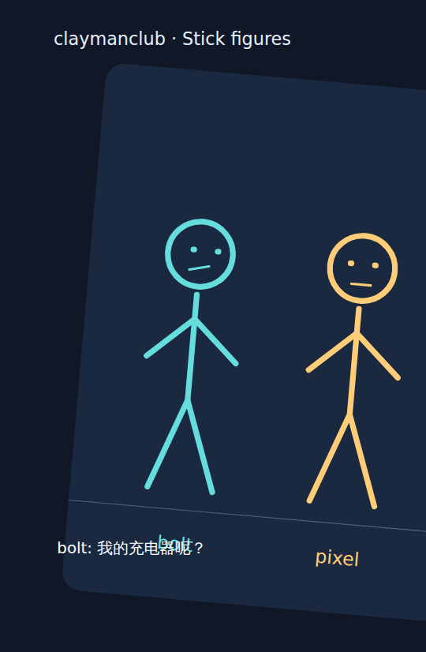
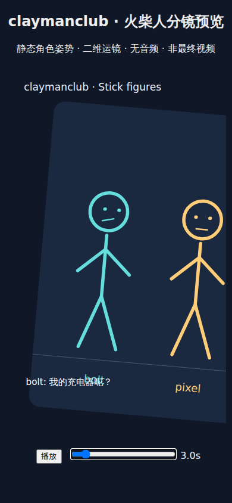
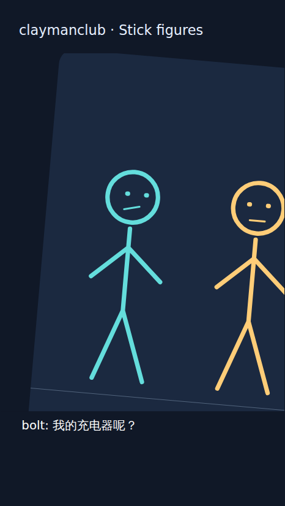
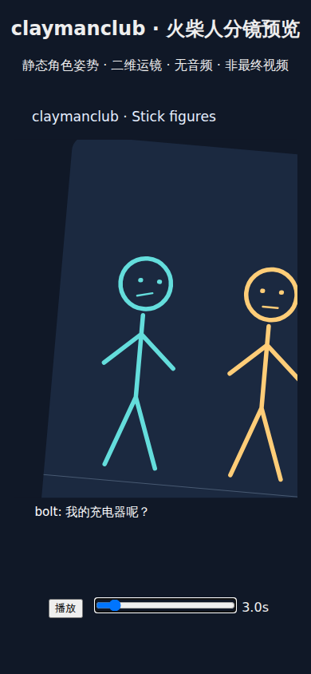

# PR #1: real-browser camera validation

Date: 2026-10-09. Scope: v0.3 camera trajectories and deterministic SVG/HTML
playback, with v0.2 compatibility. No camera protocol changes or continuous
character animation.

## Reproduce

```sh
npm ci
npx playwright install --with-deps chromium
# Linux: install fonts-noto-cjk for the example's Chinese text
npm run test:browser
python -m unittest discover -s tests -v
```

Playwright 1.56.1 is an optional, lockfile-pinned development dependency. The
Python renderer still uses only the standard library. The browser suite renders
fresh self-contained HTML with the production CLI, opens it with file://, and
asserts there are no external requests, browser console errors or page errors.
Screenshots and environment metadata go to `outputs/browser-tests/run-*/`.
The CI artifact `chromium-camera-evidence` retains full results for 30 days;
selected evidence is checked in here for durable review.

## Coverage

Four browser tests cover:

- SVG pixels change with pan/rotation/zoom; a real SVG transformed point matches
  an independent trigonometric calculation at frame 90. Pixels outside the SVG
  viewport remain unchanged. Adjacent frames 89/90/91 have bounded motion.
- Frame 90 is pixel identical after seeking backward across a cut and after
  reload. Title/subtitle pixels and fixed control geometry remain stable.
- Native button clicks, pointer dragging and keyboard range input exercise
  play, pause, seeking, 179→180 shot transition, end-of-story stop and replay.
  Playback and direct seeking to the same frame give identical SVG screenshots.
- A separate test leaves requestAnimationFrame and the clock unmodified and
  verifies actual timed playback/pause of the v0.2 fixture. A 390×844 viewport
  checks portrait proportions, visible subtitle bounds and reachable controls.

Most timing tests use Playwright's controlled browser clock for reproducibility;
DOM, layout, painting, SVG transforms and input handling remain real Chromium.
No test calls player functions or writes player state directly.

## Findings and fixes

Baseline run: [37918638929](https://github.com/lifengqing-bp/claymanclub/actions/runs/37918638929)
(commit `22416e0`, renderer unchanged from the original PR). Controls/replay and
unmodified requestAnimationFrame/v0.2 tests passed. Viewport/geometry checks failed.

1. The SVG had an intrinsic width of 540px but CSS height of 75vh. Its CSS viewport
   did not retain 540:960 proportions, leaving extra internal letterbox space;
   transformed scene content could enter that space. The renderer now computes
   a proportional width capped by viewport width and 75vh height, uses auto
   height, explicitly clips SVG overflow and supplies a mobile viewport meta tag.
2. Visual inspection of frame 90 found the moving `bolt` label overlapping the
   fixed subtitle. Fixed opaque title/subtitle backdrops now keep scene content
   from obscuring text. Pixel comparisons cover these regions. Camera motion may
   intentionally crop world content at viewport/caption boundaries; it must not
   obscure the fixed overlays.

Before the fix:





## Verified result

[Successful run 37918840073](https://github.com/lifengqing-bp/claymanclub/actions/runs/37918840073),
source/test commit `eccdc46845c8b2c384f408cda910703e0bad9356`:
**4/4 real-browser tests and 13/13 Python/Node tests passed**, no skips.
Chromium 141.0.7390.37 / Playwright 1.56.1, Linux, Noto CJK installed.
Desktop viewport 1000×1100, narrow viewport 390×844, device scale 1.
Browser suite duration: approximately 11.5 seconds excluding installation.

Visual inspection of the following actual browser screenshots confirms the
scene pans/rotates/zooms, fixed overlays remain readable and the shot cut resets
to the next composition. At frame 90 the right actor is partly out of frame,
as expected from this authored pan/zoom; the viewport no longer exposes scene
content beyond the logical 540×960 canvas. The fixed caption band deliberately
occludes world labels that move into it. Frame 179→180 is an authored hard cut,
not an interpolation discontinuity within the shot.

| Frame | Purpose |
| --- | --- |
| [0](frame-000.png) | Initial wide shot |
| [90](frame-090.png) | Maximum example zoom, pan and roll; protected caption |
| [179](frame-179.png) | Last visible frame before the cut |
| [180](frame-180.png) | New shot and reset camera |
| [899](frame-899.png) | Final visible frame |
| [Narrow frame 90](mobile-frame-090.png) | Proportional SVG and native controls |





The source and tests in the successful run are unchanged by this evidence-only
report commit. CI also reruns on subsequent PR changes.

## Limits

This suite targets Chromium on Linux, not Safari/WebKit or Firefox. The narrow
viewport check is responsive desktop Chromium, not a physical iPhone test.
Pixel equality is asserted within the same run/environment; these evidence PNGs
are review artifacts, not portable cross-platform golden baselines. The checked
trajectory and example dialogue do not establish visual quality for every valid
camera path or arbitrarily long subtitle. The deliberate cut at frame 180 is
expected; continuous character animation is outside scope.
